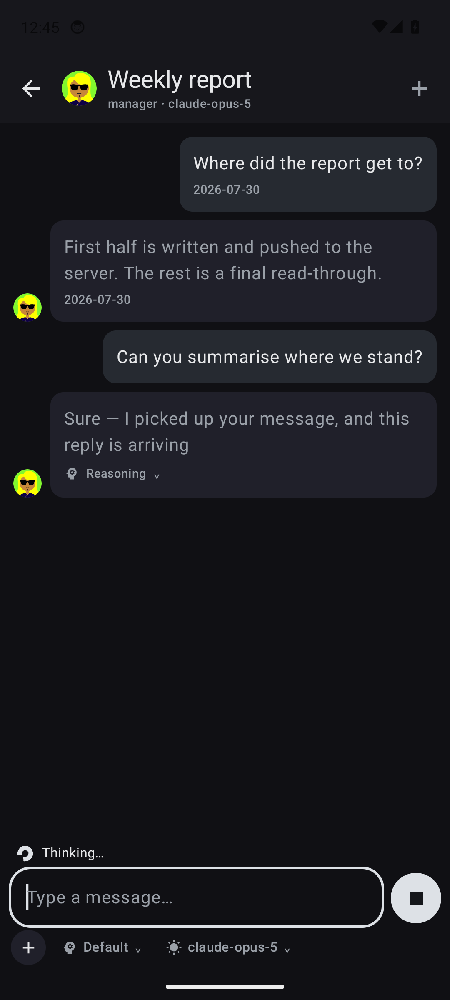
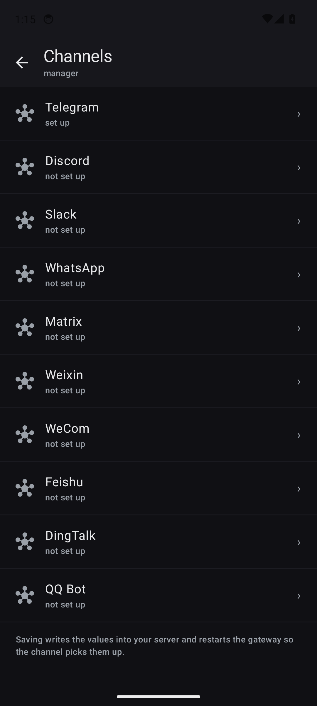

# Hermes Studio Mobile — Android

An **unofficial, community-built** native Android client for
[Hermes Studio](https://github.com/EKKOLearnAI/hermes-studio).
Not affiliated with EKKOLearnAI.

The Studio web UI is built for the desktop, so this app talks to the same HTTP API
directly and renders a native, phone-shaped interface instead of wrapping a web view.

## What works today (v1.2.0)

- **Replies stream in as they are written**, over the same `/chat-run` socket the
  web UI uses, with a stop button that calls the run off mid-sentence. If the
  socket cannot be reached the app quietly falls back to the REST wrapper, so a
  reverse proxy that blocks WebSockets costs you the streaming, not the answer
- **The reasoning is kept**, folded under the reply, and the composer says which
  tool the agent is running while it works
- **Manage conversations**: long-press to rename or delete one
- **Manage profiles**: create, rename and delete them from the profiles screen
- **Group chat is writable**: create a room, choose which agents are in it, post
  into it over the room socket and watch replies arrive, or delete the room
- **Agent tools have their own bottom tab**, beside Chats and Groups. Jobs,
  Kanban, Channels, Skills, Plugins, MCP, Pets, Memory and Models now have one
  predictable home. Every one opens a native Android screen; none sends you to
  the desktop website
- **Mobile Kanban inspired by modern task apps**: switch boards, search, create a
  task, inspect its result and runs, assign it, and comment. Hold a card and drag
  left or right to move it between stages, or use its Move menu for precise and
  accessible control
- **Skills are native and editable** for Hermes, Claude, and Codex targets: search,
  enable, pin, import a ZIP, open `SKILL.md`, edit it, save it, or delete a local
  skill
- **Plugins, MCP, and Petdex are native too**: inspect or toggle standalone plugins;
  add, edit, test, reload, and delete MCP servers without losing advanced JSON;
  and adopt, enable, or resize a companion from the phone
- **Channels are set up from the app**, on their own screen: enter a bot token (or
  the app id, secret and the rest — each channel asks for exactly the fields the
  server maps), turn a channel on or off, or remove its credentials. Saving writes
  into your server and it restarts the gateway itself, so the channel comes up ready
- **Scheduled jobs (Cron Jobs) are fully manageable** for the active profile:
  create and edit the schedule, prompt, model, skills, delivery target and repeat
  limit; pause or resume it, run it immediately, delete it, and read its run output.
  Every call uses the same profile-scoped endpoints and `X-Hermes-Profile` header
  as Studio.
- **Settings no longer contains another confusing settings menu**: the main page
  carries device preferences and About, while one clearly named **More settings**
  entry contains account security, IP locks, super-admin user management, context
  compression, session reset and approvals, privacy, proxy, and Studio display.
  Agent-specific configuration lives in the Agent tab. Every native value is read
  from and saved to the active profile through the same contracts as the web UI
- **Agent settings**: max turns, gateway timeout, restart drain timeout, tool
  enforcement, and **gateway auto-start where Studio keeps it** — including the
  profile policy, so a server with several profiles can start only the ones that
  actually answer on a channel
- **The system back button behaves**: it walks back through the app — a conversation,
  a room, an Agent tool, More settings, settings, or the groups tab — and only
  closes the app from the chat list
- **Confirmation before anything you cannot undo**: signing out and restarting a
  profile's gateway both ask first, naming the profile that will stop answering
- **Ready for other languages**: every string lives in one file, adding a language is
  a copy plus two lines, and a test fails the build on a missing key or a broken
  placeholder. Right-to-left layouts are handled too, mirrored icons included, and the
  language is picked in Settings or before signing in — see
  [docs/adding-a-language.md](docs/adding-a-language.md)
- **The same profile pictures Studio shows**: an uploaded avatar, or the Multiavatar
  generated from the profile name — rendered on the device and cached, so a launch
  draws them from disk instead of pulling them again
- **Your Studio logo as the app mark**, fetched from your own server (`/logo.png`) and
  cached; swap it for any picture on your phone from Settings → This device
- **First-run walkthrough** explaining what the app is and that you supply the
  Hermes Studio server yourself
- **Splash while the stored session is verified** — the sign-in form only appears when
  you actually need to sign in
- Sign in with your Studio server address, username and password
- Bearer token stored in `EncryptedSharedPreferences`, backed by the Android Keystore
- **Your existing Studio conversations**, with the same list shape as the web sidebar:
  title, timestamp, profile badge and model
- **Open any conversation and read its real history** pulled from the server, then keep
  talking in the same session
- **All profiles filter**, matching Studio's dropdown, or scope the list to one profile
- **Group chat tab**: rooms with agent and member counts, open a room to read its messages
- **Composer laid out like Studio's**: a full-width field with a `+` button and
  context chips underneath, and a single trailing button that is the microphone until
  you type, then becomes send
- **The `+` sheet** carries everything the conversation needs: Camera, Gallery and File
  tiles, plus the model and the reasoning effort — new controls become one more row
- **Change the model** per conversation, applied with `POST /api/hermes/sessions/{id}/model`
- **Change reasoning effort** (default, low, medium, high), sent as `reasoning_effort`
  on every run, the same field the web composer sets
- Attachments upload to your server and ride along with the message as proper
  content blocks
- **Voice**: record, then transcribe directly into the composer through your Studio
  STT provider without sending the recording as a chat attachment
- Profiles screen to switch which agent a new chat talks to
- Start a fresh conversation at any time
- Studio's dark palette, RTL-aware layout (Arabic reads correctly)

## Screenshots

| | |
| --- | --- |
|  |  |
|  |  |

## Install

Grab `hermes-studio-android.apk` from the
[latest build](https://github.com/twuijri/hermes-studio-mobile/releases/tag/latest-debug) and open it on your phone.

Android shows **"Play Protect hasn't seen an app from this developer before"** — that
appears for every app installed outside the Play Store. Choose **Install anyway**.

Every push to `main` rebuilds that release, so the link always points at the newest
build, and each build is signed with the same project key so it installs straight over
the previous version.

GitHub-built copies also check that rolling release at launch. When its published
commit differs from the installed build, the app offers to download the APK and
hands it to Android's package installer. Android still requires the user to approve
the installation and to allow this app as an update source once.

> Installed a build from before 2026-07-30? Uninstall the old app once, then install
> this one. Those builds were signed with a throwaway key that CI regenerated on every
> run, which is why Android refused to update them in place.

## How it talks to your server

| Purpose | Endpoint |
| --- | --- |
| Sign in | `POST /api/auth/login` |
| Verify a stored token | `GET /api/auth/me` |
| Account security and IP locks | `POST /api/auth/change-password` · `POST /api/auth/change-username` · `GET` / `DELETE /api/auth/locked-ips` |
| Super-admin account management | `GET` · `POST /api/auth/users` · `PUT` · `DELETE /api/auth/users/{id}` |
| Profiles | `GET /api/hermes/profiles` |
| Conversations | `GET /api/hermes/sessions?profile=…` |
| Conversation history | `GET /api/hermes/sessions/conversations/{id}/messages` |
| Group chat rooms | `GET /api/hermes/group-chat/rooms` |
| Room detail and messages | `GET /api/hermes/group-chat/rooms/{id}` |
| Upload an attachment | `POST /upload?profile=…` |
| Transcribe a recording | `POST /api/hermes/stt/transcribe` |
| Available models | `GET /api/hermes/available-models?profile=…` |
| Set a conversation's model | `POST /api/hermes/sessions/{id}/model` |
| Profile default model | `GET /api/hermes/config` · `PUT /api/hermes/config/model` |
| Studio setting sections | `GET /api/hermes/config` · `PUT /api/hermes/config` |
| Model-provider credentials | `PUT /api/hermes/config/providers/{provider}` |
| Restart a profile's gateway | `POST /api/hermes/profiles/{name}/gateway/restart` |
| Send a message (streaming) | Socket.IO `/chat-run` — `run`, `abort` |
| Send a message (fallback) | `POST /api/chat-run/runs` |
| Rename / delete a conversation | `POST /api/hermes/sessions/{id}/rename` · `DELETE /api/hermes/sessions/{id}` |
| Create / rename / delete a profile | `POST /api/hermes/profiles` · `POST /api/hermes/profiles/{name}/rename` · `DELETE /api/hermes/profiles/{name}` |
| Create / delete a room | `POST` · `DELETE /api/hermes/group-chat/rooms` |
| Post into a room | Socket.IO `/group-chat` — `join`, `message` |
| Channel state and gateway auto-start | `GET /api/hermes/config` · `PUT /api/hermes/config` |
| Channel credentials | `PUT /api/hermes/config/credentials` · `DELETE /api/hermes/config/credentials/{platform}` |
| Scheduled jobs | `GET` · `POST /api/hermes/jobs` · `PATCH` · `DELETE /api/hermes/jobs/{id}` |
| Pause / resume / run a job | `POST /api/hermes/jobs/{id}/pause` · `resume` · `run` |
| Scheduled job run history | `GET /api/cron-history` · `GET /api/cron-history/{jobId}/{fileName}` |
| Kanban boards and tasks | `GET /api/hermes/kanban/boards` · `GET` / `POST /api/hermes/kanban` · `POST /api/hermes/kanban/tasks/bulk` |
| Kanban detail, comments, and assignees | `GET /api/hermes/kanban/{id}` · `POST /api/hermes/kanban/{id}/comments` · `GET /api/hermes/kanban/assignees` |
| Skills | `GET /api/hermes/skills` · `GET` / `PUT` / `DELETE /api/hermes/skills/{category}/{name}` · `PUT /api/hermes/skills/toggle` · `pin` |
| Plugins | `GET /api/hermes/plugins` · `POST /api/hermes/plugins/{key}/enable` · `disable` |
| MCP servers | `GET` · `POST /api/hermes/mcp/servers` · `PATCH` / `DELETE /api/hermes/mcp/servers/{name}` · `POST /api/hermes/mcp/reload` |
| Petdex and active pet | `GET /api/hermes/petdex/manifest` · `GET` / `PATCH /api/hermes/pets/active` · `POST /api/hermes/pets/adopt` |
| App mark | `GET /logo.png` (static, cached on the device) |

Both sockets authenticate with the same bearer token, passed in the Socket.IO
handshake (`auth.token`) rather than a header. `POST /api/chat-run/runs` is the
server's own REST wrapper around `/chat-run`: the app uses it whenever the socket
cannot connect, which is why the app still works behind a proxy that drops
WebSocket upgrades.

All traffic goes to the address you enter, over HTTPS. Nothing is sent anywhere else and
there is no analytics. The app asks for `INTERNET`, plus `RECORD_AUDIO` and `CAMERA` only
at the moment you first use the microphone or the camera. Recordings and captures are
written to the app cache, uploaded, and deleted immediately.

## Roadmap

- Answering an approval request the agent raises mid-run
- Editing a profile's avatar from the app, not only reading it
- Voice settings (STT and TTS providers) from the app
- Native push notifications for finished runs, approvals, and scheduled reports
  after the Studio server implements the capability-gated APNs/FCM contract in
  [`../docs/push-notifications.md`](../docs/push-notifications.md)

## Build locally

```bash
gradle assembleDebug
```

Requires JDK 17 and the Android SDK (compileSdk 35). CI builds the same target on every
push, so a local SDK is optional.

### Running it without a Studio server

`tools/mock-studio.py` answers the REST endpoints the app calls, with sample profiles,
conversations, accounts, settings, model providers, a room, scheduled jobs, Kanban,
skills, plugins, MCP servers, and Petdex — enough
to open and edit every screen. It does not
speak Socket.IO, which makes it a good way to exercise the REST fallback: messages
still get answered, just not word by word.

```bash
python3 tools/mock-studio.py
```

Sign in from a debug build at `http://10.0.2.2:8099` on an emulator, with any
username and password. Debug builds permit plain HTTP to that host; release builds
keep Android's default and refuse it.

## Contributing

Issues and pull requests are welcome — this is meant to be a community client.

**Translating it** is the easiest place to start and needs no Kotlin: copy one XML
file, translate it, add two lines. [docs/adding-a-language.md](docs/adding-a-language.md)
walks through it, and `gradle test` checks your work.

The native iOS client lives beside this project in [`../ios`](../ios/). Keep shared
API behavior and public release versions aligned when changing either platform.

## Credits

Generated profile pictures come from the Multiavatar generator, ported to Kotlin so the
app and the web UI draw the same face for the same profile. Avatars by
[Multiavatar.com](https://multiavatar.com) — its license ships in
`app/src/main/assets/multiavatar-LICENSE.txt`.

Hermes Studio's own artwork is **not** bundled in this APK. The logo you see is read
from the server you connect to, which is also why replacing `logo.png` on that server
changes the mark here.

## License

MIT — see [LICENSE](../LICENSE).
